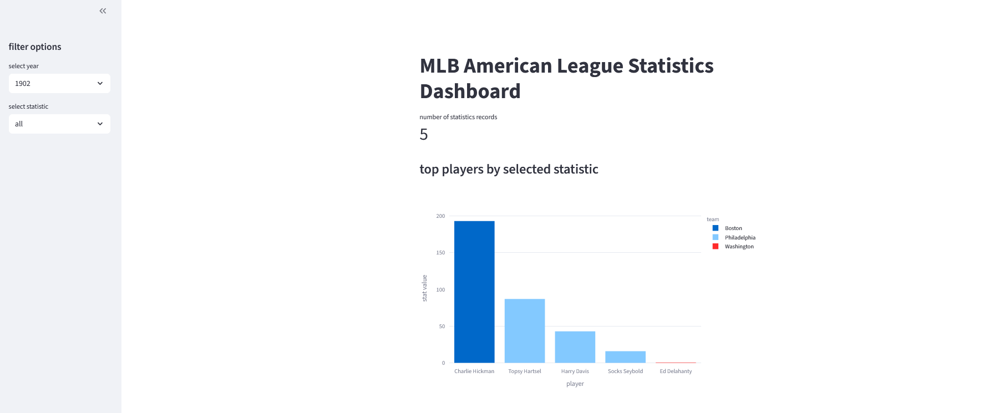
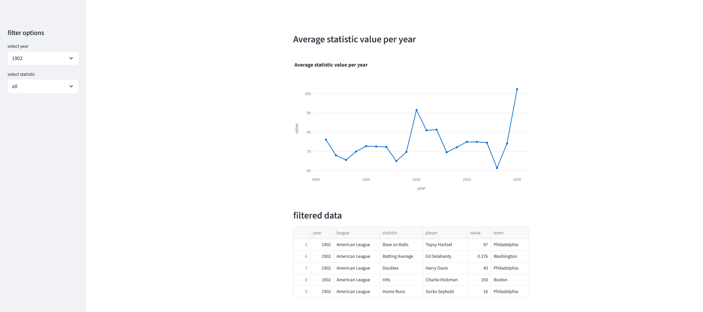

# MLB American League Dashboard

## Project Summary
This project scrapes historical Major League Baseball (MLB) data, including yearly events and player statistics. The data is cleaned, stored in a SQLite database, and visualized through an interactive Streamlit dashboard. Users can explore statistics by year, player, team, and selected metrics.

## Features
- Web scraping using Selenium to retrieve MLB data.
- Cleans and transforms data with Pandas.
- Stores data in a SQLite database for easy querying.
- Interactive dashboard built with Streamlit:
  - Filter by year or statistic
  - Top players by selected statistic
  - Average statistic trends over the years
  - Displays filtered data in a table
  - Visualizations with Plotly for interactive charts.

## Setup / Installation

1. Clone the repository
2. Create and activate a virtual environment (optional but recommended)
3. Install dependencies
4. Ensure the database file is in the db/ folder
5. Run the Streamlit dashboard (dashboard.py)

## Dependencies
Python 3.11+
Streamlit
Pandas
Plotly
SQLite3
Selenium (for data scraping)
Webdriver Manager (for Selenium)

## Screenshot

